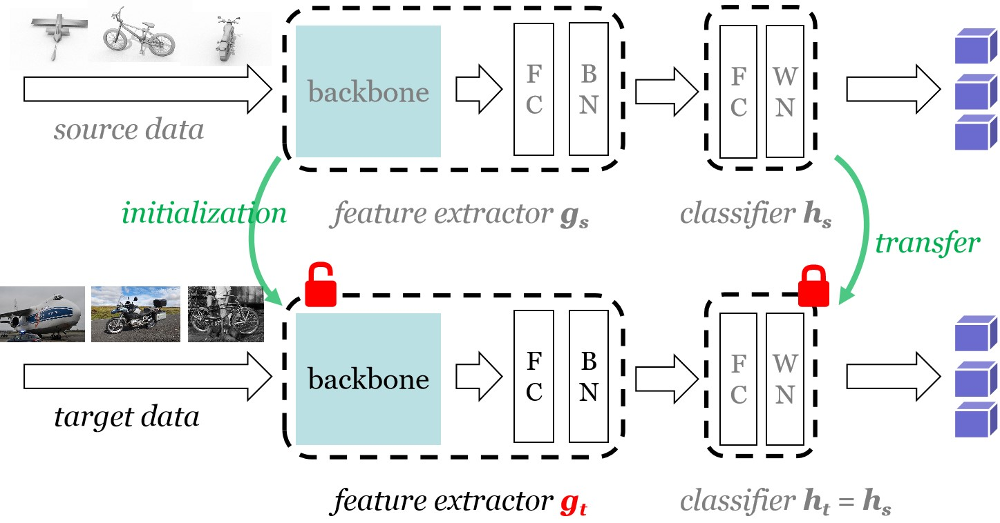

Code for our ICML (2020) paper **Do We Really Need to Access the Source Data? Source Hypothesis Transfer for Unsupervised Domain Adaptation**. 



### Prerequisites:
- python == 3.6.8
- pytorch ==1.1.0
- torchvision == 0.3.0
- numpy, scipy, sklearn, PIL, argparse

### Dataset:

- Please manually download the datasets [Office](https://drive.google.com/file/d/0B4IapRTv9pJ1WGZVd1VDMmhwdlE/view), [Office-Home](https://drive.google.com/file/d/0B81rNlvomiwed0V1YUxQdC1uOTg/view), [VisDA-C](https://github.com/VisionLearningGroup/taskcv-2017-public/tree/master/classification), [Office-Caltech](http://www.vision.caltech.edu/Image_Datasets/Caltech101/101_ObjectCategories.tar.gz) from the official websites, and modify the path of images in each '.txt' under the folder './object/data/'.

- Concerning the **Digits** dsatasets, the code will automatically download three digit datasets (i.e., MNIST, USPS, and SVHN) in './digit/data/'.

### Training:
1. ##### Unsupervised Closed-set Domain Adaptation (UDA) on the Digits dataset
	- MNIST -> USPS (**m2u**)   SHOT (**cls_par = 0.1**) and SHOT-IM (**cls_par = 0.0**)
	```python
	cd digit/
	python uda_digit.py --dset m2u --gpu_id 0 --output seed2020 --seed 2020 --cls_par 0.0
	python uda_digit.py --dset m2u --gpu_id 0 --output seed2020 --seed 2020 --cls_par 0.1
	```
	
2. ##### Unsupervised Closed-set Domain Adaptation (UDA) on the Office/ Office-Home dataset
	- Train model on the source domain **A** (**s = 0**)
    ```python
    cd object/
    python image_source.py --trte val --da uda --output seed2020 --seed 2020 --gpu_id 0 --dset office --max_epoch 30 --s 0
    ```
	
	- Adaptation to other target domains **D and W**, respectively
    ```python
    python image_target.py --savename par0.0 --cls_par 0.0 --zz val --da uda --output seed2020 --seed 2020 --gpu_id 0 --dset office --max_epoch 30 --s 0
    python image_target.py --savename par0.3 --cls_par 0.3 --zz val --da uda --output seed2020 --seed 2020 --gpu_id 0 --dset office --max_epoch 30 --s 0  
    ```

3. ##### Unsupervised Closed-set Domain Adaptation (UDA) on the VisDA-C dataset
	- Synthetic-to-real 
    ```python
    cd object/
	python uda_visda.py --savename par0.0 --cls_par 0.0 --zz val --da uda --output seed2020 --seed 2020 --gpu_id 0 --max_epoch 3
	python uda_visda.py --savename par0.3 --cls_par 0.3 --zz val --da uda --output seed2020 --seed 2020 --gpu_id 0 --max_epoch 3
	 ```
	
4. ##### Unsupervised Partial-set Domain Adaptation (PDA) on the Office-Home dataset
	- Train model on the source domain **A** (**s = 0**)
	```python
	cd object/
	python image_source.py --trte val --da pda --output seed2020 --seed 2020 --gpu_id 0 --dset office-home --max_epoch 30 --s 0
	```

	- Adaptation to other target domains **C and P and R**, respectively
	```python
	python image_target.py --savename par0.0 --cls_par 0.0 --zz val --da pda --gent '' --threshold 10 --output seed2020 --seed 2020 --gpu_id 0 --dset office-home --max_epoch 30 --s 0
	python image_target.py --savename par0.3 --cls_par 0.3 --zz val --da pda --gent '' --threshold 10 --output seed2020 --seed 2020 --gpu_id 0 --dset office-home --max_epoch 30 --s 0
   ```

5. ##### Unsupervised Open-set Domain Adaptation (ODA) on the Office-Home dataset
	- Train model on the source domain **A** (**s = 0**)
	```python
	cd object/
	python image_source.py --trte val --da oda --output seed2020 --seed 2020 --gpu_id 0 --dset office-home --max_epoch 30 --s 0
	```
	
	- Adaptation to other target domains **C and P and R**, respectively
	```python
	python image_target_oda.py --savename par0.0 --cls_par 0.0 --zz val --da oda --output seed2020 --seed 2020 --gpu_id 0 --dset office-home --max_epoch 30 --s 0
	python image_target_oda.py --savename par0.3 --cls_par 0.3 --zz val --da oda --output seed2020 --seed 2020 --gpu_id 0 --dset office-home --max_epoch 30 --s 0
	```

6. ##### Unsupervised Multi-source Domain Adaptation (MSDA) on the Office-Caltech dataset
	- Train model on the source domains **A** (**s = 0**), **C** (**s = 1**), **D** (**s = 2**), respectively
	```python
	cd object/
	python image_source.py --trte val --da uda --output seed2020 --seed 2020 --gpu_id 0 --dset office-caltech --net resnet101 --max_epoch 30 --s 0
	python image_source.py --trte val --da uda --output seed2020 --seed 2020 --gpu_id 0 --dset office-caltech --net resnet101 --max_epoch 30 --s 1
	python image_source.py --trte val --da uda --output seed2020 --seed 2020 --gpu_id 0 --dset office-caltech --net resnet101 --max_epoch 30 --s 2
	```
	
	- Adaptation to the target domain **W** (**t = 3**)
	```python
	python image_target.py --savename par0.3 --cls_par 0.3 --zz val --da uda --output seed2020 --seed 2020 --gpu_id 0 --issave 1 --dset office-caltech --net resnet101 --max_epoch 30 --s 0
	python image_target.py --savename par0.3 --cls_par 0.3 --zz val --da uda --output seed2020 --seed 2020 --gpu_id 0 --issave 1 --dset office-caltech --net resnet101 --max_epoch 30 --s 1
	python image_target.py --savename par0.3 --cls_par 0.3 --zz val --da uda --output seed2020 --seed 2020 --gpu_id 0 --issave 1 --dset office-caltech --net resnet101 --max_epoch 30 --s 2
	python image_multisource.py --savename par0.0 --zz val --da uda --output seed2020 --seed 2020 --gpu_id 0 --dset office-caltech --net resnet101 --max_epoch 30 --t 3
	```
	
7. ##### Unsupervised Multi-target Domain Adaptation (MTDA) on the Office-Caltech dataset
	- Train model on the source domain **A** (**s = 0**)
	```python
	cd object/
	python image_source.py --trte val --da uda --output seed2020 --seed 2020 --gpu_id 0 --dset office-caltech --net resnet101 --max_epoch 30 --s 0
	```
	
	- Adaptation to multiple target domains **C and P and R** at the same time
	```python
	python image_multitarget.py --savename par0.0 --cls_par 0.0 --zz val --da uda --output seed2020 --seed 2020 --gpu_id 0 --dset office-caltech --net resnet101 --max_epoch 30 --s 0
	python image_multitarget.py --savename par0.3 --cls_par 0.3 --zz val --da uda --output seed2020 --seed 2020 --gpu_id 0 --dset office-caltech --net resnet101 --max_epoch 30 --s 0
	```

8. ##### Unsupervised Partial Domain Adaptation (PDA) on the ImageNet-Caltech dataset without source training by ourselves (using the downloaded Pytorch ResNet50 model directly)
	- ImageNet -> Caltech (84 classes) [following the protocol in [PADA](https://github.com/thuml/PADA/tree/master/pytorch/data/imagenet-caltech)]
	```python
	cd object/
	python image_pretrained.py --savename par0.0 --cls_par 0.0 --output seed2020 --seed 2020 --gpu_id 0 --max_epoch 30
	python image_pretrained.py --savename par0.3 --cls_par 0.3 --output seed2020 --seed 2020 --gpu_id 0 --max_epoch 30
	```

**Please refer *run.sh*** for all the settings for different methods and scenarios.

### Citation

If you find this code useful for your research, please cite our paper

> @inproceedings{liang2020shot,  
>  &nbsp; &nbsp;  title={Do We Really Need to Access the Source Data? Source Hypothesis Transfer for Unsupervised Domain Adaptation},  
>  &nbsp; &nbsp;  author={Liang, Jian and Hu, Dapeng and Feng, Jiashi},  
>  &nbsp; &nbsp;  booktitle={International Conference on Machine Learning (ICML)},  
>  &nbsp; &nbsp;  pages={xx-xx},  
>  &nbsp; &nbsp;  month = {July},  
>  &nbsp; &nbsp;  year={2020}  
> }

### Contact

- [liangjian92@gmail.com](mailto:liangjian92@gmail.com)
- [dapeng.hu@u.nus.edu](mailto:dapeng.hu@u.nus.edu)
- [elefjia@nus.edu.sg](mailto:elefjia@nus.edu.sg)
